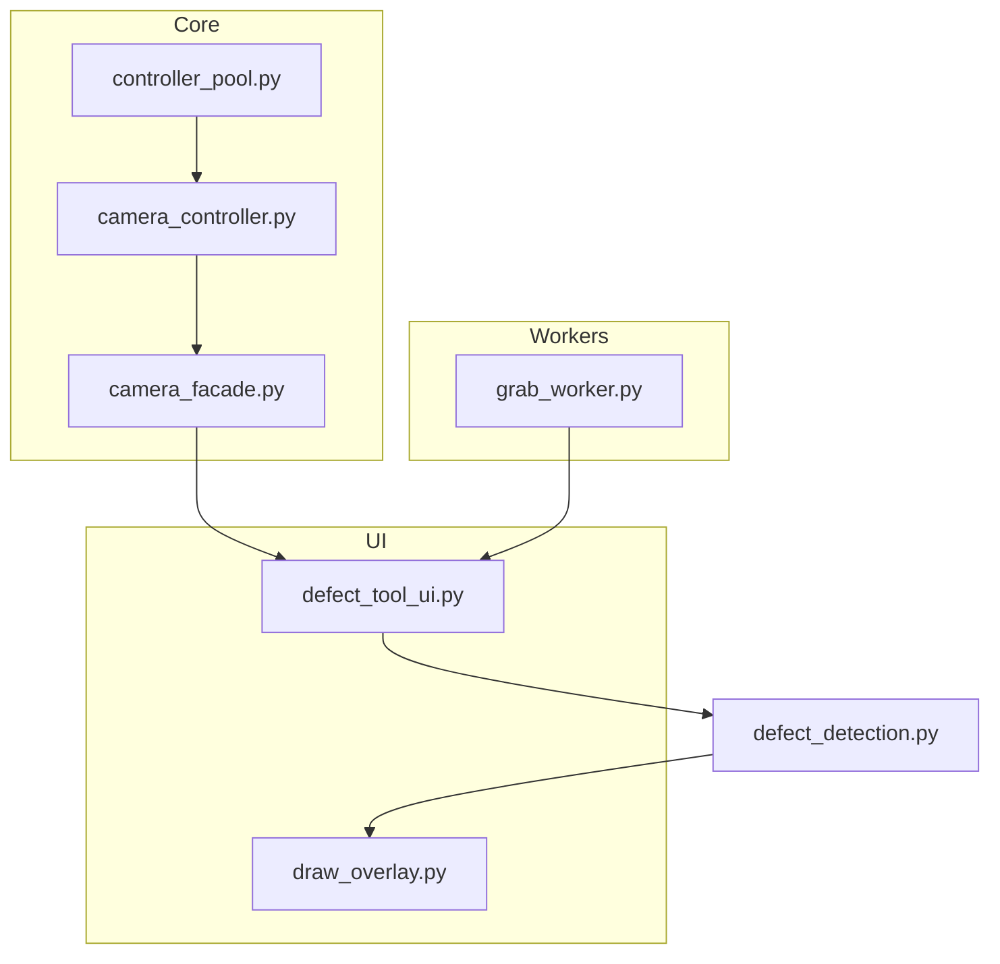

# Defect Pixel Finder

PyQt5 기반 GUI 도구로, 카메라/이미지에서 **Dark / Bright 불량 픽셀(defect pixel)** 을 탐지하고
결과를 CSV로 저장하는 프로젝트입니다. 

---

## 주요 기능

- 단일 프레임에서 Dark / Bright 불량 픽셀 탐지
- 8bit 및 10/12/14/16bit 이미지 지원 (Bayer RAW, Mono, RGB 계열)
- Euresys Coaxlink + eGrabber 기반 카메라 연동 (없는 경우에는 파일 불러오기 모드로 사용)
- 불량 픽셀 위치를 이미지 위에 오버레이로 시각화
- 불량 픽셀 목록을 CSV로 내보내기

---


## 디렉터리 구조

```text
Defect_Pixel_Finder/
├─ main.py                  # 프로그램 엔트리 포인트
├─ defect_tool_ui.py        # PyQt5 GUI (메인 윈도우)
├─ defect_detection.py      # 불량 픽셀 탐지 알고리즘
├─ draw_overlay.py          # 이미지 위에 불량 픽셀 표시용 오버레이
├─ core/
│  ├─ camera_controller.py  # eGrabber 기반 카메라 제어
│  ├─ camera_exceptions.py  # 카메라 관련 예외 정의
│  ├─ camera_facade.py      # Qt 용 QOject 래퍼(CxpCamera)
│  └─ controller_pool.py    # CameraController 풀/관리
└─ workers/
   └─ grab_worker.py        # 프레임 드레인용 백그라운드 스레드
```

```markdown
## Module Diagram



---

## 각 모듈 설명

### `main.py`

- 명령행 인자 파싱
  - `--log-level {DEBUG,INFO,WARNING,ERROR}`
  - `--highdpi` : Qt High-DPI 스케일링 강제
  - `--icon` : 윈도우 아이콘 파일 경로
- `QApplication` 을 생성하고 `DefectTool` 위젯을 띄운 뒤 이벤트 루프 실행

### `defect_tool_ui.py`

불량 픽셀 찾기 툴의 메인 UI를 구현합니다.

- **버튼/컨트롤**
  - Connect : 카메라 탐색 후 첫 번째 카메라 연결
  - Snap    : 현재 프레임 한 장 캡처
  - Open Image : 파일에서 이미지 열기
  - Dark Search / Bright Search : 현재 이미지에 대해 불량 픽셀 검색
  - Export CSV : 탐지된 불량 픽셀 목록을 CSV로 저장
- **파라미터**
  - Block size      : 타일 크기 (지역 평균 계산용)
  - Dark level (DN) : 다크 픽셀 기준 DN 오프셋
  - Bright (±%)     : 주변 평균 대비 편차 비율
  - PixelFormat (Load) : 파일 로드시 가정할 픽셀 포맷
  - Histogram normalize / stretch : 화면 표시용 히스토그램 정규화/스트레치
- 카메라에서 프레임을 가져오거나, 파일에서 이미지를 읽어와
  `defect_detection.py` 의 알고리즘을 호출해 Dark/Bright 결과를 얻습니다.
- `draw_overlay.py` 의 기능을 사용해 이미지 위에 사각형/마커를 오버레이합니다.

### `defect_detection.py`

실제 불량 픽셀 탐지 로직이 들어있는 모듈입니다.

주요 역할:

- Bayer / Mono / RGB 등 포맷을 공통의 그레이스케일 포맷으로 변환
- 블록 평균 및 보간을 이용한 지역 평균 계산
- Dark / Bright 픽셀 판단
- 마스크에서 클러스터(영역)를 만들어 내고, 그 사각형/개수/점 리스트를 반환

파일 안에는 대략 다음과 같은 함수들이 들어있습니다.

- 포맷/전처리
  - `bayer_to_flat(...)`, `bayer_flatfield_equalize(...)`
  - `rgb_flatfield_equalize(...)`
  - 히스토그램 정규화 유틸
- 불량 픽셀 탐지
  - `FindDarkFieldClusterRect_...`
  - `FindBrightFieldClusterRect_...`
- 마스크 → 클러스터 변환 헬퍼

### `draw_overlay.py`

- `DefectLoc` : 오버레이 하나(색, 두께, 사각형, 라벨)를 표현하는 데이터 클래스
- `DrawFigure` : 여러 개의 `DefectLoc` 을 관리하며, 원본 이미지 위에 그려 주는 헬퍼

GUI에서 검출 결과를 표시할 때 이 모듈을 사용합니다.

### `core` 패키지

#### `camera_controller.py`

- Euresys eGrabber 기반 카메라를 제어하는 클래스
- 카메라 검색, 연결/해제, 그랩 시작/중지, 프레임 수신 등을 담당
- 신호/슬롯을 통해 새 프레임이 들어올 때 상위 레이어에 알려줍니다.
- eGrabber 모듈이 없는 환경에서는 더미 클래스로 동작하도록 설계되어 있어
  카메라 없이도 프로그램 자체는 실행 가능하게 되어 있습니다.

#### `camera_facade.py`

- `CxpCamera` 라는 Qt `QObject` 래퍼를 정의
- 내부에서 `CameraController` 를 사용하며, UI 쪽에서는 보다 단순한 인터페이스로
  사용할 수 있도록 감싼 형태입니다.

#### `controller_pool.py`

- 여러 `CameraController` 인스턴스를 ID 기준으로 등록/조회/브로드캐스트할 수 있는
  글로벌 풀을 관리합니다.

#### `camera_exceptions.py`

- 카메라 관련 오류를 표현하는 커스텀 예외 클래스들을 정의합니다.

### `workers/grab_worker.py`

- `QThread` 기반의 백그라운드 스레드
- 카메라에서 들어오는 프레임을 연속으로 읽어와 상위로 전달하는 역할
- 드라이버 버퍼 오버플로 방지를 위해 큐를 지속적으로 비워 주는 용도입니다.

---

## 설치 및 실행

### 1) 의존성

- Python 3.8 이상 권장
- 필수 패키지
  - `PyQt5`
  - `numpy`
  - `opencv-python`
- 카메라 연동을 사용할 경우 (선택)
  - Euresys Coaxlink 보드
  - Euresys eGrabber SDK 및 Python 바인딩

예시:

```bash
pip install PyQt5 numpy opencv-python
# eGrabber 관련 모듈은 Euresys 공식 설치 프로그램으로 설치
```

### 2) 실행 방법

```bash
python main.py --log-level INFO --highdpi
```

또는

```bash
python -m main
```

옵션:

- `--log-level` : `DEBUG / INFO / WARNING / ERROR` 중 선택
- `--highdpi` : 고해상도 모니터에서 강제로 High-DPI 스케일링 활성화
- `--icon` : 윈도우 타이틀/작업표시줄 아이콘으로 사용할 파일 지정

---

## 사용 예시

### 카메라가 있을 때

1. 프로그램 실행
2. **Connect** 버튼 클릭 → 카메라 검색 및 연결
3. **Snap** 버튼으로 프레임 1장 캡처
4. Block size, Dark level, Bright% 를 조정
5. **Dark Search**, **Bright Search** 버튼으로 불량 픽셀 검색
6. 결과 오버레이를 확인하고, 필요하다면 **Export CSV** 로 저장

### 카메라 없이 이미지 파일로만 사용할 때

1. 프로그램 실행
2. **Open Image** 버튼으로 테스트 이미지를 선택
3. PixelFormat (Load) 을 실제 포맷에 맞게 선택
4. 나머지 파라미터를 조정 후 Dark/Bright Search 수행
5. CSV 저장

---

## CSV 포맷

CSV는 대략 다음과 같은 형식으로 저장되도록 구성할 수 있습니다
(실제 구현 내용에 따라 헤더 등은 수정될 수 있습니다).

```text
x,y   # 각 줄이 하나의 불량 픽셀 좌표 (열, 행)
10,15
100,200
...
```


